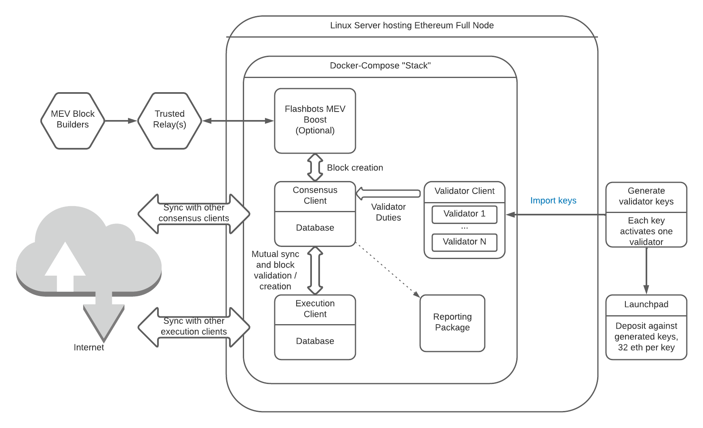

## This project

eth-docker aims to make running an Ethereum staking full node simpler than setting everything up manually,
while allowing the user choice when it comes to the exact client mix they wish to run.

Recommended hardware, whether your own hardware or a VPS, is:
- 32 GiB of RAM - 16 GiB works but can be challenging depending on client mix
- 4 CPU cores
- 2TB ["mainstream" SSD](https://gist.github.com/yorickdowne/f3a3e79a573bf35767cd002cc977b038) - neither QLC nor DRAMless. 1TB can work with some client combinations but is very tight; 2TB affords more room for growth

## Node components

An Ethereum staking full node has many moving parts. Here's a high level, conceptual overview.

> The original naming conventions were "eth1" for the execution client, and "beacon"
> for the consensus client. You will still encounter these names in several places,
> particularly in the logs of the consensus client.
> Ethereum PoS (Proof-of-Stake) was also called Ethereum 2.0 at one point, but uses the same ETH token.

When setting up an Ethereum staking full node, you'll:

- Configure and run an execution client and sync it with the Görli testnet or main net
- Configure and run an Ethereum consensus client and sync it with the Görli testnet or main net
- Generate validator keys, one per 32 Eth you wish to stake. This can and often is done outside of the
  machine used to run the node, for security reasons.
- Import validator keys into the validator client, each validator key activates one validator
- Once the Ethereum execution client and consensus client are fully synced with the chain, deposit Ethereum
  at the launchpad, 32 ETH per validator key. That Ethereum is now locked up until after the "merge" 
  of Ethereum PoS (Proof-of-Stake) with Ethereum PoW (Proof-of-Work).

Here's what then happens:

- The chain processes the deposit and activates the validators: Your validators start earning rewards
  and penalties.
- The consensus client is where it all happens: Block generation, attestations, slashings, with the help
  of the validator(s) inside the validator client, for signing.
- A validator earns a reward for every epoch (6.4 minutes) it is online, and a penalty of 3/4 that
  amount for every epoch it is offline. "Online" means that it sent its scheduled attestation / block
  proposal. This means you want to be online almost 24/7, but do not have to be afraid of a few hours
  of downtime, with the exception of periods of non-finality.
- Greater 2/3 of validators need to be online for the chain to "finalize". If the chain stops finalizing,
  far harsher penalties for offline validators kick in. Stay online during non-finality. The initial
  penalties on main net for this "inactivity" during non-finality have been reduced to 1/4th of their eventual
  values.
- "Slashing" is a harsh penalty and forced exit for malicious validators; regular penalties could be
  described as "Leaking" instead. The most likely mistake that gets you slashed is to run a validator key
  in two separate validator clients simultaneously. The initial slashing penalty on main net has been reduced
  to 1/4th of its eventual value.
- If all of the above was so much Gobbledegook, you may want to read the [Ethereum PoS primer](https://ethos.dev/beacon-chain/) and come
  back to it every time you have questions. 

## Guiding principles:

- Reduce the attack surface of the client as much as feasible.
- Guide users to good key management as much as possible
- Create something that makes for a good user experience and guides people new to docker and Linux as much as feasible
