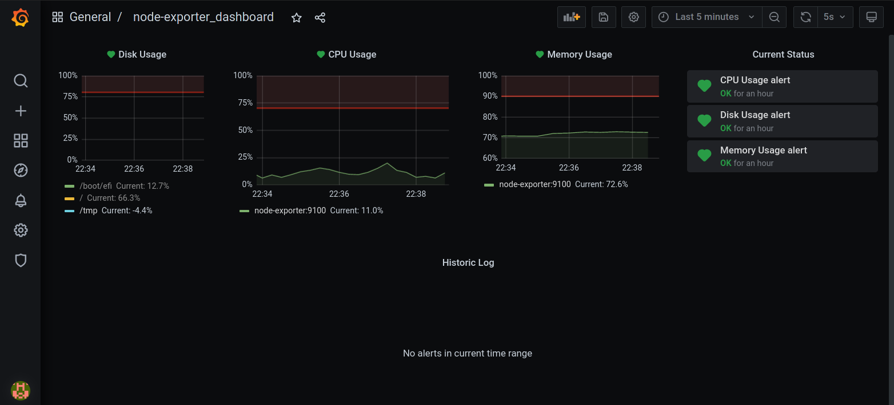

For reference, here are disk, RAM and CPU requirements, as well as mainnet initial
synchronization times, for different Ethereum 1 clients.

PRs to add to this information welcome.

## Monitoring Requirments with Node Dashboard  

The following [Dashboard](https://raw.githubusercontent.com/eth2-educators/eth2-docker/master/grafana/node-exporter_dashboard.json) is included with the eth2-docker grafana default config.  Using it you can monitor Disk, CPU and Memory usage by you node.  Furthermore you can configure the alerts to notify you via discord, telegram or anywhere else grafana supports.  Check this [link](https://grafana.com/docs/grafana/latest/alerting/notifications/) for more information.

## Disk, RAM, CPU requirements

SSD, RAM and CPU use is after initial sync, when keeping up with head. 100% CPU is one core.

| Client | Version | Date | DB Size  | DB Growth | RAM | CPU | Notes |
|--------|---------|----  |----------|-----------|-----|-----|-------|
| OpenEthereum | Nov 2020 | 3.1.0rc1 | ~380 GiB | ~ 3.5 GiB / week | 1 GiB | 100-300% | DB grows with chain, prunes itself |
| Geth   | 1.10.1 | Mar 2021 | ~350 GiB | ~ 10 GiB / week | 9 GiB | 100-400% | DB size can be reduced by offline(!) prune with `docker-compose run --rm eth1 snapshot prune-state` |
| Nethermind | 1.10.51 | Mar 2021 | ~170 GiB | ~17 GiB / week | 9 GiB | 100-400% | memory use w/ pruning and prune-cache 4096; initial size lower bcs of ancient barrier |
| Besu | v20.10.2 | Dec 2020 | ~420 GiB | ~ 78 GiB / week | 6 - 9 GiB | 200-300% | |

## Test Systems

IOPS is random read-write IOPS [measured by fio with "typical" DB parameters](https://arstech.net/how-to-measure-disk-performance-iops-with-fio-in-linux/).

A note on Contabo: Stability of their service [is questionable](https://www.reddit.com/r/ethstaker/comments/l5d69l/if_youre_struggling_with_contabo/).

| Name                 | RAM    | SSD Size | CPU        | IOPS | Notes |
|----------------------|--------|----------|------------|------|-------|
| Homebrew Xeon        | 32 GiB | 700 GiB  | Intel Quad | 18.3k read / 6.1k write | Xeon E3-2225v6 |
| Dell R420            | 32 GiB | 1 TB     | Dual Intel Octo | 28.9k read / 9.6k write | Xeon E5-2450 |
| Contabo M/L VPS        | 16/30 GiB | 400/800 GiB  | Intel Hexa/Octa  | 3k read / 1k write | Xeon E5-2630 v4 - some Contabo VPS are AMD |
| [Netcup](https://netcup.eu) VPS 2000/3000 G9   | 16/24 GiB | 320/600 GiB  | AMD Quad/Hexa | 46.4k read / 15.5k write | |

## Initial sync times

NB: All eth1 clients need to [download state](https://github.com/ethereum/go-ethereum/issues/20938#issuecomment-616402016)
after getting blocks. If state isn't "in" yet, your sync is not done. This is a heavily disk IOPS dependent
operation, which is why HDD cannot be used for a node. For Nethermind, seeing "branches" percentage reset to "0.00%"
after state root changes with "Setting sync state root to" is normal and expected. With sufficient IOPS, the
node will "catch up" and get in sync.

| Client | Version | Date | Test System | Time Taken | Cache Size | Notes |
|--------|---------|------|-------------|------------|------------|-------|
| Geth   | 1.9.24  | Nov 2020 | Dell R420   | ~ 24 hours | default    | 3.5 days to generate snapshot on 1.10.0 |
| Geth   | 1.10.1  | Mar 2021 | Homebrew Xeon | ~ 10 hours | default  | snapshot sync; 3.5 days to generate snapshot; 3 hours to offline prune |
| Geth   | 1.9.25  | Jan 2021 | Contabo L VPS | ~ 24 hours | default  | 2 weeks to generate snapshot on 1.10.0 |
| Nethermind | 1.10.7-beta | Jan 2021 | Contabo L VPS | Never | default | VPS IOPS too low to finish Nethermind sync |
| Nethermind | 1.10.44 | Mar 2021 | Homebrew Xeon | ~ 27 hours | default | |
| Nethermind | 1.10.9 | Jan 2021 | Netcup VPS 2000 G9 | ~ 20 hours | default | |
| Besu | 20.10.4 | Jan 2020 | Homebrew Xeon | ~ 6 days 8 hours | default | |
